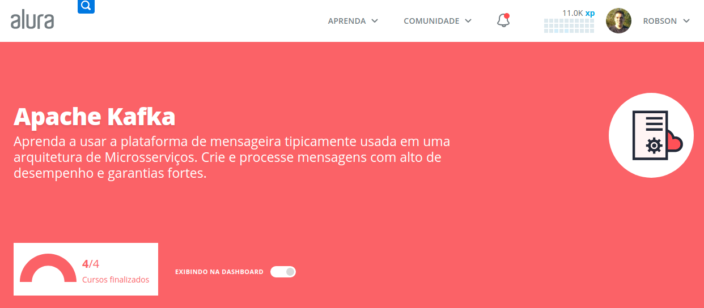
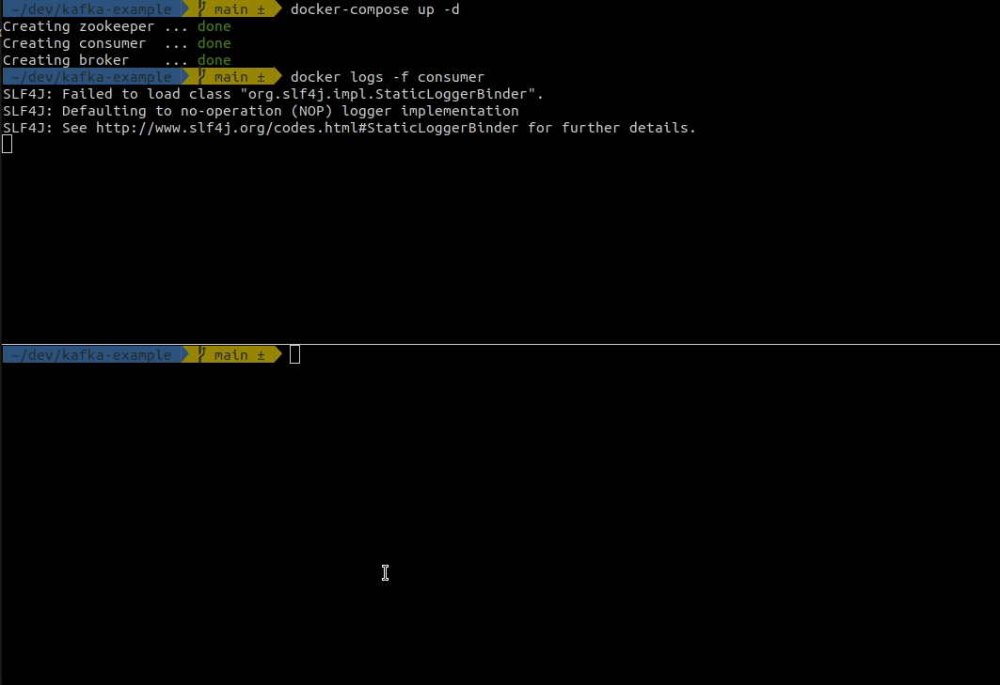

# kafka-example



This project demonstrates some of the concepts learned in [Allura's Apache Kafka formation](https://cursos.alura.com.br/formacao-kafka).

The project is simple, to serve as a basis for other projects, and so that the concepts of producers and consumers can be easily visualized.

## Running

Running Kafka, Zookeeper and consumer

```
docker-compose up -d
```

Visualize consumer logs

```
docker logs -f consumer
```

On another terminal, run producer. This creates ten Order events. You can run this command many times.

```
docker run --rm --name=producer --net=host robsonbittencourt/kafka-example-producer
```

 
